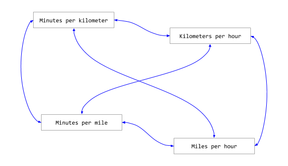

# pace-converter

Universal running pace converter. Minutes per kilometer, Kilometers per hour, Minutes per mile, Miles per hour.

[](https://github.com/facebook/jest)

## How to use the Library

```bash
➜ ~ npm i -S pace-converter
```

```javascript
const convert = require('pace-converter').convert;

const model = convert('4:50', 'minkm');

console.log('model:', JSON.stringify(model, null, 2));
```

## How to use the CLI

```bash
➜ ~ npm i -g pace-converter
➜ ~ pace-converter-convert -p 4:40 -u minkm
{ minkm: '04:40.00', kmh: 12.857, minmi: '07:30.60', mih: 7.989 }
```

## Convert

- [X] Minutes per kilometer: 'minkm'

- [X] Kilometers per hour: 'kmh'

- [X] Minutes per mile: 'minmi'

- [X] Miles per hour: 'mih'

## Converters



- [X] Minutes per kilometer to Kilometers per hour (minkm2kmh)

- [X] Kilometers per hour to Minutes per kilometer (kmh2minkm)

- [X] Minutes per kilometer to Minutes per mile (minkm2minmi)

- [X] Minutes per mile to Minutes per kilometer (minmi2minkm)

- [X] Minutes per kilometer to Miles per hour (minkm2mih)

- [X] Miles per hour to Minutes per kilometer (mih2minkm)

- [X] Kilometers per hour to Minutes per mile (kmh2minmi)

- [X] Minutes per mile to Kilometers per hour (minmi2kmh)

- [X] Kilometers per hour to Miles per hour (kmh2mih)

- [X] Miles per hour to Kilometers per hour (mih2kmh)

- [X] Miles per hour to Minutes per mile (mih2minmi)

- [X] Minutes per mile to Miles per hour (minmi2mih)
